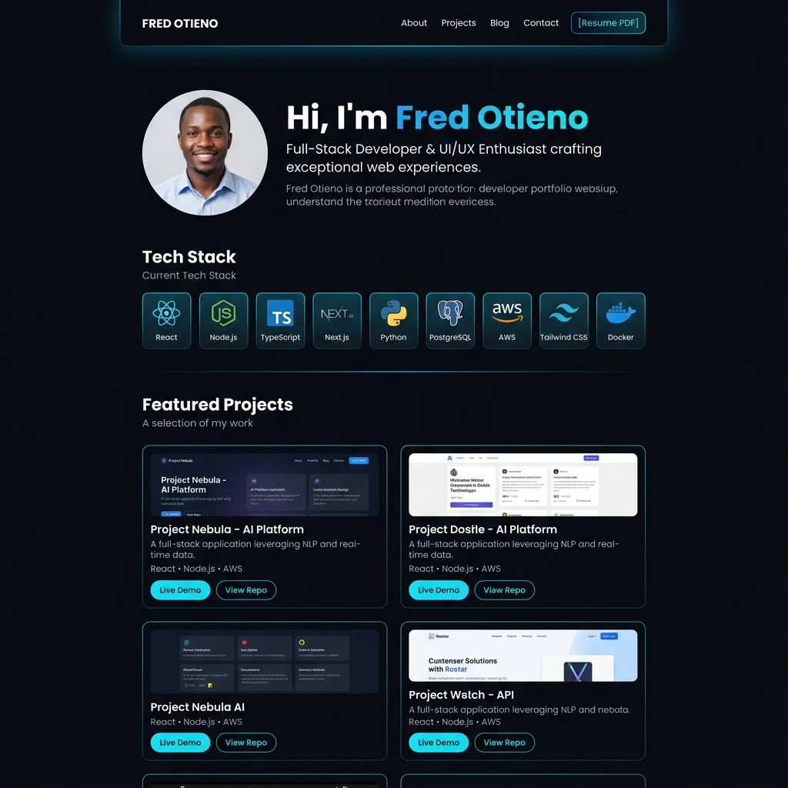

# Fred's Developer Portfolio 🌐

Hey there! 👋 I'm Fred Otieno, a Full Stack Web Developer based in Nairobi, Kenya. Welcome to my personal portfolio repository! 

This is the main storefront/hub where I showcase my web development journey, technical skills, and featured projects.

## 📸 Portfolio Preview

## 🛠️ What's Inside?
This single-page portfolio features a responsive dark-themed design with smooth scrolling animations, floating background particles, and an elegant layout highlighting:
- **About Me:** My journey from Inceptor Institute of Technology & Nyakach TVC.
- **Skill Badges:** Grid representing my MERN stack expertise (React, Node, Express, MongoDB) along with tools like TS, Git, and Bootstrap.
- **Projects Grid:** Visual card deck displaying my 8 featured projects.

---

## 🚀 Featured Projects Showcased Here

Here are the projects integrated into this portfolio, each featuring its own custom landing page and responsive UI:

1. **🛒 ShopEase** — E-commerce MERN application (React, Node.js, MongoDB) | [Repo](https://github.com/Fred4377/shopease)
2. **📊 DashPro Dashboard** — Admin analytics dashboard with Chart.js | [Repo](https://github.com/Fred4377/dashpro-dashboard)
3. **📅 BookEase** — Online scheduling and reservation app (MERN) | [Repo](https://github.com/Fred4377/bookease)
4. **🤖 ChatBotPro** — Conversational AI chat interface client (React) | [Repo](https://github.com/Fred4377/chatbotpro)
5. **⚙️ CCGworkflow** — Task columns Kanban board (TypeScript, React) | [Repo](https://github.com/Fred4377/CCGworkflow)
6. **💈 Premium Barber Shop** — Styling storefront for "Elite Cuts" | [Repo](https://github.com/Fred4377/barbar-shop)
7. **🏨 Grand Horizon Hotel** — Luxury hotel reservation page | [Repo](https://github.com/Fred4377/Hotel)
8. **📱 Obachi Mobile Shop** — Mobile phone catalog storefront | [Repo](https://github.com/Fred4377/project)

---

## 💻 Tech Stack Used for the Portfolio
- **Frontend structure:** Semantic HTML5
- **Styling:** Custom CSS3 layout (CSS variables, flexbox, transitions, glassmorphic panels)
- **Animations:** Vanilla JS with `IntersectionObserver` to trigger reveal animations on scroll
- **Performance:** Dynamic pure CSS particles rather than heavy third-party Canvas engines

## How to View
To check out the source code and run the portfolio website locally:

1. Clone this repository
2. Open `index.html` in any web browser!

Feel free to reach out if you have any questions or want to collaborate! ☕
